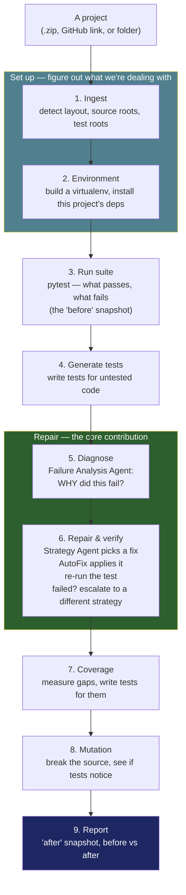

# AUTEF v2 — the whole project, explained plainly

This document assumes you know nothing about the project. It explains what the
problem is, how the system is put together, what every stage does and why it
exists, what every control in the app does, how the measurement works, and what
the system deliberately cannot do.

---

## 1. What problem is this solving?

Software projects have **unit tests** — small programs that check the main
program still works. When someone changes the code, tests break. Fixing broken
tests is dull, repetitive work, and there is a lot of it.

An earlier M.Tech project, **AUTEF** (Agentic Unit Test Enhancement Framework),
used AI to help. It could do four useful things:

1. **Write** new tests for code that had none
2. **Measure coverage** — how much of the code the tests actually run
3. **Mutation testing** — deliberately break the code and see if the tests notice
4. **Repair** tests that were failing

It worked. But it had two limits, and this project exists to fix them.

### Limit 1 — it only worked on one application

Not "mostly worked elsewhere". Would not run at all. The project's own file
paths were typed into the source code:

```python
PROJECT_ROOT = os.path.abspath(r"D:\Sai\EnhanceUnitTesting")
SOURCE_FOLDER_PATH = os.path.join(PROJECT_ROOT, "source_files")
APP_NAME = "InsuranceApp_Modified"
```

Every capability had a version of this problem:

| Capability | What was hardcoded |
|---|---|
| Mutation testing | `target_module = f"source_files.{APP_NAME}"` |
| Coverage | `coverage.Coverage(include=["*/source_files/*"])` |
| Finding files | Guessed the filename from the test's class name |
| Running tests | `unittest`, with an absolute `top_level_dir` |

Upload a different project and you don't get different results — you get
failures the framework cannot act on.

### Limit 2 — repair was one generic prompt

Every failure — a broken import, a wrong assertion, a badly configured mock —
went to the same prompt. The system:

- never asked **why** the test failed
- tried the fix **once**
- **never re-ran the test** to see whether the fix worked
- never tried a second approach

It also had find-and-replace rules tuned to that one application:

```python
if "AttributeError" in error_reason:
    test_function_code = re.sub(r"\.name", ".item", test_function_code)
```

That swaps `.name` for `.item` on *any* AttributeError, anywhere. It was a fix
for one bug in one insurance app.

### What v2 does about it

1. **Every stage reads the project you upload** instead of a constant.
2. **Repair diagnoses first, verifies after, and changes approach when a fix fails.**

That's the whole thesis. Everything below is detail.

---

## 2. How it fits together

### The layered view

The full system architecture — every layer, every module, and the two external
dependencies — is in **[`docs/autef2_architecture.svg`](docs/autef2_architecture.svg)**.
Open it in a browser, or insert it directly into the report or the slide deck
(it is vector, so it stays sharp at any size).

Read top to bottom, it says: a project comes in → the user drives it from the
app or the CLI → orchestration decides what runs → the agent layer is the only
part that talks to the model → the execution core is where v1's hardcoded paths
used to be → the evaluation harness runs both versions on identical inputs →
everything lands in one `RunReport`.

Green marks what is new in v2 or was rewritten for it. Grey marks a v1
capability that was kept and re-pointed at the uploaded project.

### The flow view



**The single most important design idea:** every stage reads the same detected
`ProjectLayout` and runs in the same per-project virtualenv. That is what makes
this one framework rather than a repair tool with extras bolted on.

---

## 3. The nine stages — what each does and why it exists

### Stage 1 — Ingest

**Does:** takes a `.zip`, a GitHub URL, or a folder. Unpacks it into a working
copy. Then works out the project's shape: is the code in `src/`, in a package
folder, or flat at the top? Where are the tests? What does it declare as
dependencies? Can it be installed?

**Why it exists:** this is the stage that turns every path in the framework from
a typed-in constant into a value read from your project. Without it, nothing
else can be portable no matter how well written.

**Design note:** it always works on a *copy* inside a workspace, never on your
original folder. Later stages write files (generated tests, repaired tests), and
they must never touch your actual project.

### Stage 2 — Environment

**Does:** creates a fresh Python virtualenv for this project and installs the
project plus its dependencies into it.

**Why:** someone else's tests import libraries you don't have. Running them in
your Python either fails on missing packages or silently uses the wrong
versions.

**Design note — installing the project's *own pinned* pytest.** Flask declares a
bare `pytest` dependency but locks version 9.0.3, and its test configuration
uses an internal API removed in 9.1. Install the newest pytest and the whole
suite dies. So the version is read from `uv.lock`, `poetry.lock` or
`Pipfile.lock`. This is the kind of thing you only discover by running real
repositories.

### Stage 3 — Run suite

**Does:** runs the tests with **pytest** and records exactly what passed, what
failed, and why. This is the **"before" snapshot** — the project as it arrived.

**Why pytest instead of v1's unittest:** most Python projects write tests in
pytest style (plain functions, fixtures, parametrize). Under `unittest`
discovery those projects report **zero tests found**. pytest also collects
`unittest` tests, so switching loses nothing and gains most of the ecosystem.

**Why it also decides scope:** if the suite cannot run at all, the project is out
of scope and the run stops here — before any money is spent on AI calls.

**Design note — test roots run one at a time.** Flask ships example test folders
for demos that aren't installed. In a single pytest run, one unimportable
configuration file zeroed all 479 working tests. Running each test folder
separately means a broken corner can't erase the working ones.

### Stage 4 — Generate tests

**Does:** finds code with no tests, asks the AI to write some, writes the file,
then **runs it**.

**Why it's placed here — after the baseline, before diagnosis:** a generated test
that *fails* is exactly what the repair loop exists for. Putting generation
before repair means the two compose: the framework writes tests, some break, and
it then diagnoses and fixes its own output. If generation sat off to the side,
repair would only ever see faults you injected manually.

**Why the code is split by syntax, not by size:** v1 cut source files every 512
characters, so a function's signature landed in one chunk and its body in the
next — the AI was asked to test half a function. v2 splits at function and class
boundaries so the AI always sees something whole.

**Why the output is checked:**

| What happened | What the system does |
|---|---|
| pytest can't even load the file | delete it — it would break every later run |
| loads, but contains no tests | delete it |
| runs, some tests fail | **keep it** — that's input for stages 5 and 6 |

v1 wrote whatever came back and counted it as success.

**A bug found and fixed here:** generation used to write to `test_<module>.py` —
which is exactly what a project calls its own test file. On a project with one
test file it **overwrote the user's tests**. The replacements were written
against observed behaviour so they all passed, and the run reported "0 failing"
— data loss that looked like success. Files are now given a non-colliding name
unless the framework itself wrote the existing one.

### Stage 5 — Diagnose

**Does:** the **Failure Analysis Agent** reads the error and the traceback and
names the root cause: import error, assertion mismatch, mock misconfiguration,
API misuse, fixture setup error.

**Why it's a separate stage:** it's a different question from "how do I fix it",
and separating them means you can *look* at the diagnoses before paying for
repair attempts. It is also the thing v1 never did at all.

### Stage 6 — Repair & verify

**Does:** three things per failing test.

1. **Repair Strategy Agent** maps the diagnosed cause to a matching repair
   strategy, and picks the next one it hasn't already tried.
2. **AutoFix Agent** applies that fix.
3. **The test is re-run.** If it passes, guards check the fix didn't cheat by
   weakening the assertion, and didn't break a test that was previously passing.

If it still fails, the system **escalates** — it tries a *different* strategy,
not the same one again.

**The clever bit:** if the failure *changed* — say `ModuleNotFoundError` became
`AssertionError` — the system goes back and **re-diagnoses** instead of
escalating. The fix worked; it just revealed the next problem underneath. v1
couldn't tell the difference because it never looked at the result of its own
repair.

**Caching:** if a failure has the same shape as one already repaired, it starts
from the strategy that worked before instead of re-diagnosing from scratch.

### Stage 7 — Coverage

**Does:** measures which lines and branches the tests never execute, asks the AI
to write tests for the gaps, and measures again.

**Why after repair:** a broken test measures nothing.

**Why it runs as a separate process:** v1 measured coverage *inside its own
running program*, with a cached object. Three consequences: the folder name was
hardcoded; it could only see code the host program imported; and a second
project measured in the same session reported the first project's numbers. v2
runs coverage as a subprocess inside the project's own virtualenv.

**A bug found and fixed here:** structlog's configuration sets `parallel = true`
for coverage (normal — it lets CI merge results). Coverage then ignores the
filename it's given and writes `<name>.<host>.<pid>.<random>` instead. The
system looked for the exact name, found nothing, and reported "the coverage run
produced no data" — about a run that had just measured 2,125 statements. Now the
fragments are combined.

### Stage 8 — Mutation

**Does:** deliberately breaks the source code one operator at a time (`==`
becomes `!=`, `+` becomes `-`, `and` becomes `or`, constants change), runs the
tests, and records whether the tests noticed. A change the tests *don't* notice
is a "surviving mutant" — a gap in the tests. The AI is then asked to write a
test that catches it.

**Why v2 has its own mutation engine:** v1 drove an external tool (cosmic-ray)
pointed at one hardcoded module. That tool must be installed into the project's
environment and driven through a session database whose interface changes
between releases. In an arbitrary project's virtualenv that's a compatibility
fight with no upside. Generating mutants directly from the code's syntax tree
needs nothing installed, is repeatable given a seed, and lets each mutant be
described to the AI precisely.

**Why mutants are sampled rather than truncated:** taking the first N would
mutate one file exhaustively and never touch the rest — then report that one
file's score as the whole project's.

**Two guards v1 had no equivalent of:**

- **The green-suite gate.** If any test is already failing, the phase refuses to
  run and says why. Against a failing suite you cannot tell "the tests caught
  it" from "the tests were already broken". *This is why mutation must come
  after repair.*
- **Kill verification.** A new test only counts if it **passes on the original
  code and fails on the broken code**. Passes both → it didn't catch anything.
  Fails both → it's just broken. Keeping either would raise the reported score
  without raising the tests' real sensitivity.

### Stage 9 — Report

**Does:** runs the full suite one last time (the "after" snapshot) and assembles
everything into one object: before vs after, per-test repair records, coverage
before/after, mutation score before/after, tokens, cost, duration.

**Why one object:** it's the same structure the benchmark and the v1-vs-v2
comparison consume. The demo and the measurement therefore cannot drift apart
and start disagreeing.

---

## 4. The app, control by control

Run it with:

```bash
python -m autef2 web
```

Then open `http://127.0.0.1:8000` and sign in with `autef` / `autef2025`.

### The sidebar (always visible)

| Control | Type | Default | What it does |
|---|---|---|---|
| **Model** | dropdown | `gpt-5.6-sol` | Which AI model to use. Held constant when measuring, so a v1-vs-v2 difference is never just "one used a better model". Changing it mid-session rebuilds the client, so later stages use what the dropdown says. |
| **Thinking effort** | dropdown | `medium` | How hard a reasoning model thinks before answering. Ignored by models that do not reason. |
| **Escalation rungs per test** | slider, 1–5 | 3 | How many *different* repair strategies to try before giving up on a test. This slider is the v2 contribution made adjustable — set it to 1 and repair behaves much more like v1. |
| **Isolated virtualenv per project** | checkbox | off | Build a fresh environment and install the project's dependencies. Slow but correct. **Turn it on for any project with third-party imports.** Leave it off for small dependency-free projects to save minutes. |
| **Reuse strategies for repeated failures** | checkbox | on | The cache. When a failure looks like one already fixed, skip diagnosis and start from the strategy that worked. Faster, but turn it off when measuring. |
| **Limit to first N failing tests** | number, 0 = all | 0 | Caps how many failing tests get attempted. Bounds the cost of one run. |

**Phase limits** (these bound cost of stages 4, 7 and 8):

| Control | Range | Default | What it does |
|---|---|---|---|
| **Modules to generate for** | 1–50 | 5 | Stage 4 writes one test file per module. This caps how many. |
| **Files to write coverage tests for** | 1–30 | 3 | Stage 7 cap. |
| **Mutants to score** | 1–200 | 20 | Stage 8. **This is the main cost driver of mutation** — each mutant is a whole test-suite run. |
| **Surviving mutants to write tests for** | 1–30 | 5 | How many gaps stage 8 asks the AI to fill. |

At the bottom: whether an API key was found, where the workspace is, and a
**Reset session** button that clears everything and starts over.

### Tab 1 — "Repair a project"

**Source picker:** upload a `.zip`, paste a GitHub or archive URL (add
`/tree/<branch>` for a specific branch), or point at a folder on your machine.

**Nine stage buttons**, in two rows of five and four. They light up in sequence —
a button stays disabled until the stage before it has produced what it needs.

```
1. Ingest    2. Environment   3. Run suite   4. Generate tests   5. Diagnose
6. Repair & verify   7. Coverage   8. Mutation   9. Report
```

Stages **4 through 8 call the AI** (and cost money). Stages 1, 2, 3 and 9 don't.

**"Run all stages"** chains all nine. It skips diagnosis and repair when nothing
is failing — a green project still gets coverage and mutation.

**Rule to remember:** re-running a stage discards everything derived from it.
Click stage 3 again and the diagnoses and repairs below it are cleared, because
they described a state that no longer exists.

Below the buttons, each stage renders its own result panel as it completes:
detected layout, environment, suite results, generated tests, diagnoses,
repairs, coverage, mutation, and the final before/after report — plus buttons to
download the report as JSON or the repaired project as a zip.

### Tab 2 — "Compare v1 vs v2"

This is the **demo**: one repository, both versions, readable test by test.

| Control | Default | What it does |
|---|---|---|
| **Faults to seed** | 8 | Real repositories mostly pass, so there'd be nothing to repair. This deliberately breaks that many currently-passing tests first. |
| **Cap failing tests** | 8 | Bounds the cost of one comparison. |
| **Seed** | 1337 | Makes the fault seeding repeatable. Same seed → identical faults. |
| **Fault kinds** | all five | Which kinds of breakage to seed. **This matters more than it looks** — see below. |

**Why fault kinds matter:** v1 repairs a failing test *function*. An import error
breaks the whole file, so there's no function to replace — v1 cannot attempt it
at all. A comparison loaded with import errors makes v2 look far better than it
is, for a structural reason rather than a repair-quality one. Choosing the mix
deliberately is what makes the result honest.

**Output:** a paired table (one row per test, v1's outcome beside v2's), the four
paired counts with a statistical significance test, and cost/tokens/time both in
total and per fix.

### Tab 3 — "Benchmark"

This is the **measurement**: many repositories, aggregate numbers.

| Control | Default | What it does |
|---|---|---|
| **Manifest (JSON)** | example filled in | Your list of projects: name, source, group label, how many faults to seed, optionally which fault kinds. |
| **Arms** | both | Which versions to run. Untick one to run only that version. |
| **Projects per stratum** | 0 (= all) | Sample this many projects from each group. |
| **Seed** | 1337 | Repeatability. |
| **Leave the signature cache on** | off | Off by default: with it on, a project's result depends on which projects ran before it — not a property you want in a measurement. |

**Output:** a table with one row per version — projects processed, observations,
fixed, fix rate, mean attempts, regressions, weakened, weakening rate, cost per
fix — followed by the full written report.

---

## 5. How the measurement works

### Compare vs Benchmark

They are the **same experiment**, not two different ones. Compare literally calls
the benchmark code with a list of one project.

- **Compare** = one repository, readable test by test. This is what you demo.
- **Benchmark** = many repositories, aggregate numbers. This is what goes in the
  results chapter.

### What is held identical

For each project:

1. Run the tests to see what currently passes
2. Break some of those passing tests on purpose
3. **Take a pristine copy in that broken state**
4. Run **v1**, record everything
5. **Restore the pristine copy** — same project, same breakage
6. Run **v2**, record everything

Both versions get the same project, the same broken tests, the same virtualenv,
and the same pytest/traceback-resolution/patching machinery. **The only thing
that differs is the repair step**, which is what makes the difference
attributable to it.

### The five metrics

| Metric | What it means |
|---|---|
| **Fix rate** | how many broken tests ended up passing |
| **Attempts per fix** | how much work each fix took |
| **Regression rate** | how often a fix broke something that was working |
| **Cost per fix** | dollars per test actually fixed |
| **Weakening rate** | how often a "fix" passed by gutting the assertion |

**Weakening rate is why the other four are believable.** A test with no
assertion always passes, so any repair tool can score 100% by deleting things.
It is measured identically for both versions and costs the baseline nothing.

### Two honesty rules built into the reporting

**The baseline is a *strengthened* v1.** v1's filename guessing, its regex-based
function extraction, and its habit of appending fixes to the end of the file are
deliberately **not** reproduced. Both arms share v2's file resolution and
patching. Otherwise v1 would lose to a file-corruption bug rather than to its
prompt, and the win would be unearned. This measures prompt-and-loop only —
the smallest honest gap available.

**Unreachable failures are reported separately.** v1 cannot attempt a
file-scoped failure at all. So the report shows "put to the model" beside
"offered", and fix-rate-of-attempted beside the headline fix rate.

---

## 6. Design decisions worth knowing

| Decision | Reason |
|---|---|
| v1 is kept, untouched, in `src/agenticapp` | It is the baseline arm of the experiment, not dead code. |
| The AI model is held constant across arms | Otherwise a difference could just be a better model. |
| Nothing is trusted until it is run | A generated test, a coverage test, a mutation-killer test — each is executed and measured before being kept. |
| The layout is re-derived after any file is written | New test files change where the tests are; every later stage must see them. |
| The "before" snapshot is never rewritten | It describes the project as it arrived. A later stage that re-measures must not overwrite it, or a real improvement reads as zero. |
| Faults are seeded only into currently-passing tests | Seeding into an already-failing test gives an observation where you cannot tell which defect a repair addressed. |
| File-scoped faults get a file to themselves | A broken import turns the whole file into one error, silently destroying every other fault in it. |

---

## 7. What this deliberately cannot do

Stating the limits precisely is part of the contribution — a claim of *broader*
applicability, not general applicability.

- **Python only.** No Java, JavaScript or C#.
- **The scope line is "the suite already runs under pytest."** Not "no
  databases". django-crispy-forms processes cleanly because it configures pytest
  itself; a `manage.py` Django project fails because nothing supplies what
  `manage.py test` would.
- **Projects needing live external services** — databases, network access,
  native extensions, unusual build steps — are out of scope.
- **Very large suites are impractical.** click collects **32,965 tests**, 10,000
  of them in a single stress test, and hits the 15-minute timeout at about 72%.
  Not a bug; a genuine boundary. Check a project's size with
  `pytest --collect-only -q` before committing to it.
- **Repair can only edit the test.** A missing dependency, a genuine bug in the
  source, or a broken environment cannot be fixed by rewriting a test file, and
  the system correctly declines to try.

---

## 8. Quick reference — running it

```bash
$env:PYTHONPATH="src"
```

| Goal | Command |
|---|---|
| Is this project in scope? (free, no AI calls) | `python -m autef2 check <project>` |
| Full nine-stage run | `python -m autef2 run <project> --all-phases --venv` |
| v1 vs v2 on one repo | `python -m autef2 compare <project> -n 8` |
| Measure across many repos | `python -m autef2 bench benchmarks/manifest.json` |
| Just seed faults | `python -m autef2 inject <project> -n 10` |
| The app | `python -m autef2 web` |

**Fast projects to try:** `python-tabulate` and `cachetools` — both come back
fully green in under 8 seconds with no dependency installation.
