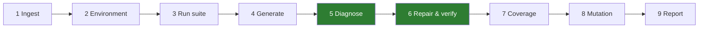

# AUTEF v2 — complete reference

Everything about the project in one place: what it is, why each part exists,
every module, every interface, how it is measured, and every failure mode known
to occur.

For a gentler introduction see [`AUTEF_V2_EXPLAINED.md`](AUTEF_V2_EXPLAINED.md).
For setup see [`INSTALL.md`](INSTALL.md). The system architecture diagram is at
[`docs/autef2_architecture.svg`](docs/autef2_architecture.svg).

---

## Table of contents

1. [What this is](#1-what-this-is)
2. [Where it came from: AUTEF v1](#2-where-it-came-from-autef-v1)
3. [Architecture](#3-architecture)
4. [The nine stages](#4-the-nine-stages)
5. [Module reference](#5-module-reference)
6. [The data model](#6-the-data-model)
7. [The repair loop in depth](#7-the-repair-loop-in-depth)
8. [The enhancement phases in depth](#8-the-enhancement-phases-in-depth)
9. [Configuration reference](#9-configuration-reference)
10. [The two interfaces](#10-the-two-interfaces)
11. [The evaluation system](#11-the-evaluation-system)
12. [Problems you may face](#12-problems-you-may-face)
13. [Bugs found by running real repositories](#13-bugs-found-by-running-real-repositories)
14. [Scope and limitations](#14-scope-and-limitations)
15. [Testing](#15-testing)
16. [Repository layout and operations](#16-repository-layout-and-operations)

---

## 1. What this is

AUTEF v2 takes an arbitrary Python project — a `.zip`, a GitHub URL or a folder
— and runs a nine-stage pipeline over it: detect what the project is, build an
environment for it, run its tests, write tests for code that has none, diagnose
whatever fails, repair it and verify the repair, raise coverage, score mutation
sensitivity, and report before against after.

It extends an earlier M.Tech capstone framework (AUTEF) which did four of those
things but only for one application, and whose repair step never checked its own
work. The two contributions are therefore:

| Contribution | What it means |
|---|---|
| **Portability** | Every stage reads the uploaded project rather than a constant. |
| **Diagnosed, verified repair** | Three agents replace one prompt; every fix is re-run, guarded, and escalated on failure. |

Both are measurable, and the repository contains the harness that measures them.

---

## 2. Where it came from: AUTEF v1

v1 lives untouched in `src/agenticapp/`. It is **not dead code** — it is the
baseline arm of the evaluation, and deleting it would remove the comparison.

### v1's four capabilities

1. Test generation from source, via an LLM
2. Branch coverage measurement and improvement
3. Mutation testing via cosmic-ray
4. Repair of failing tests

All four worked. Both limits below are about *how* they were built, not whether.

### Limit 1 — bound to one application

```python
# agenticapp/AutoGenTestEnhancer.py
PROJECT_ROOT        = os.path.abspath(r"D:\Sai\EnhanceUnitTesting")
SOURCE_FOLDER_PATH  = os.path.join(PROJECT_ROOT, "source_files")
APP_NAME            = "InsuranceApp_Modified"
target_module       = f"source_files.{APP_NAME}"
```

| Capability | What was hardcoded |
|---|---|
| Mutation | `target_module = f"source_files.{APP_NAME}"` |
| Coverage | `coverage.Coverage(include=["*/source_files/*"])`, created at import time inside `@st.cache_resource` |
| File location | test class name → CamelCase→snake_case → guessed filename |
| Execution | `unittest.defaultTestLoader.discover(..., top_level_dir="D:\\Sai\\...")` |
| Chunking | `chunk_code(code, max_chunk_size=512)` |

The coverage object being a cached singleton meant a second project measured in
the same session reported the *first* project's numbers.

### Limit 2 — generic, unverified repair

`agenticapp/agents/AutoFixingAgent.py`, in full, does four things:

1. Guesses the test file from the class name (`locate_test_file`)
2. Applies hardcoded regexes first:
   ```python
   if "AttributeError" in error_reason:
       test_function_code = re.sub(r"\.name", ".item", test_function_code)
   ```
   — a fix for one bug in one insurance app, applied to any `AttributeError`.
3. Otherwise sends one prompt: `build_fix_prompt(source, function, error)`
4. Deletes the failing function, appends the reply, **and stops**

It never re-runs the test. v1 does not know whether any repair it made worked.

### v1's own Future Scope

The report names, as items 1 and 6:

> *"Fixing Failing Test Cases — Agentic AI to identify root causes and fix
> failing tests (assertion mismatches, setup issues, dependency problems)"*
> and *"Model Evaluation and Benchmarking"*.

v2 is the execution of those two items. Frame it that way, not as a new
direction.

---

## 3. Architecture

Seven layers. Full diagram: [`docs/autef2_architecture.svg`](docs/autef2_architecture.svg).

```
INPUT          .zip · GitHub URL · directory · uploaded stream
PRESENTATION   Web UI (9 stages, signed in) · CLI (6 commands, incl. the evaluation)
ORCHESTRATION  pipeline.py · enhance.py · orchestrator.py
AGENTS         Generation · FailureAnalysis · RepairStrategy · AutoFix · CoverageImprove · MutationKill
CORE           ingest · venv_manager · runner · resolver · patcher · chunker · coverage_tool · mutation · guards
EVALUATION     faults · baseline · benchmark · compare · metrics
OUTPUT         RunReport → JSON / CSV / repaired .zip
```

**The invariant that makes it one system:** every layer consumes the same
detected `ProjectLayout` and runs in the same per-project virtual environment.
No layer contains a path to any particular application.



---

## 4. The nine stages

| # | Stage | Model? | Produces | Blocked until |
|---|---|---|---|---|
| 1 | Ingest | no | `ProjectLayout` | a source is chosen |
| 2 | Environment | no | `Environment` | stage 1 |
| 3 | Run suite | no | `before` snapshot, `failures` | stage 2 |
| 4 | Generate tests | **yes** | `GenerationOutcome` | stage 3 |
| 5 | Diagnose | **yes** | `Diagnosis` per failure | something is failing |
| 6 | Repair & verify | **yes** | `RepairRecord` per failure | stage 5 |
| 7 | Coverage | **yes** | `CoverageOutcome` | stage 3 |
| 8 | Mutation | **yes** | `MutationOutcome` | stage 3 (and a green suite) |
| 9 | Report | no | `after` snapshot | stage 3 |

### Why the order is what it is

Three orderings are load-bearing and each has a reason you should be able to
state:

**Generation at 4, before diagnosis.** A generated test that fails is exactly
what the repair loop exists for. Placing generation before repair makes the two
compose: the framework writes tests, some break, and it diagnoses and fixes its
own output. Placed after, generated failures would never reach repair.

**Mutation at 8, after repair.** `MutationPhase.run(require_green=True)` refuses
to score a suite with failing tests, because against a failing suite you cannot
distinguish *"the tests caught it"* from *"the tests were already broken"*.

**The `before` snapshot taken at 3 and never rewritten.** Stages 4 and 7 add
test files. `_collect_suite(baseline=False)` refreshes the failure list without
touching `before`, so the report always compares against the project as it
arrived.

### Stage invalidation

Re-running a stage discards everything derived from it. The map lives in
`reset_from()` in both front ends:

| Re-run | Drops |
|---|---|
| 1 | everything |
| 2 | environment onward |
| 3 | before, failures, records, after, generation, coverage, mutation |
| 4 | generation, failures, records, after, coverage, mutation — **but not `before`** |
| 5 | records, after |
| 6 | after |
| 7 | coverage, mutation, after |
| 8 | mutation, after |
| 9 | — |

---

## 5. Module reference

### Core pipeline

| Module | Lines | Responsibility |
|---|---:|---|
| `pipeline.py` | 266 | End to end: source in, `RunReport` out. Orders the phases. |
| `enhance.py` | 647 | `GenerationPhase`, `CoveragePhase`, `MutationPhase` + `EnhanceOptions`. |
| `orchestrator.py` | 307 | `RepairOrchestrator` — diagnose → strategy → apply → verify → escalate. |
| `models.py` | 567 | Every dataclass and enum shared across stages. |
| `config.py` | 221 | `AutefConfig`, API-key resolution, logging setup. |

### Portability core — where v1's constants used to be

| Module | Lines | Responsibility |
|---|---:|---|
| `ingest.py` | 643 | Unpack zip/URL/dir; `analyse()` detects layout style, source roots, test roots, dependencies, installability. |
| `venv_manager.py` | 335 | Per-project virtualenv; installs the project and **its own pinned pytest** (reads `uv.lock` / `poetry.lock` / `Pipfile.lock`). |
| `runner.py` | 457 | Runs pytest as a subprocess, one test root at a time, with an injected reporting plugin. Parses structured results. |
| `resolver.py` | 246 | Maps a failure to real files **from the traceback**, not from filename conventions. |
| `patcher.py` | 287 | AST-based location and replacement of a single test function; snapshot and rollback. |
| `chunker.py` | 308 | Splits source into whole functions and classes (replacing v1's 512-character cut). |
| `coverage_tool.py` | 295 | Runs coverage as a subprocess in the project's venv; reads `coverage json`; combines parallel-mode fragments. |
| `mutation.py` | 361 | AST mutation engine: comparison flips, arithmetic swaps, boolean swaps, constant changes. Seeded sampling. |
| `guards.py` | 249 | Assertion-weakening detection and regression detection. |
| `context.py` | 262 | Assembles the evidence a repair prompt sees, within character budgets. |
| `cache.py` | 174 | Failure-signature cache: start from the strategy that worked last time. |
| `strategies.py` | 356 | The ordered repair ladders, one per root cause. |
| `llm.py` | 293 | OpenAI wrapper with per-call token and cost accounting; `scoped()` child clients roll usage up to the root. |
| `_plugin/autef_report.py` | 124 | The pytest plugin injected into the project under test to emit structured results. |

### Agents — the only code that calls the model

| Module | Lines | Responsibility |
|---|---:|---|
| `agents/failure_analysis.py` | 247 | Names the root cause from the traceback. |
| `agents/repair_strategy.py` | 172 | Maps a cause to the next unused strategy. |
| `agents/autofix.py` | 315 | Applies the repair, re-runs, decides whether it held. |
| `agents/generation.py` | 331 | Writes a test file for a module; `reserve_path()`, `validate_generated()`. |
| `agents/coverage_improve.py` | 209 | Writes tests for uncovered lines and branches. |
| `agents/mutation_kill.py` | 185 | Writes a test that catches a surviving mutant. |

### Evaluation

| Module | Lines | Responsibility |
|---|---:|---|
| `eval/faults.py` | 434 | Seeds known faults of declared kinds into currently-passing tests. |
| `eval/baseline.py` | 271 | The v1 arm: v1's prompt verbatim, one attempt, no verification. |
| `eval/benchmark.py` | 315 | Runs both arms over a sample with the controls. |
| `eval/compare.py` | 676 | One repository, both arms, paired table + McNemar exact test. |
| `eval/metrics.py` | 393 | The five metrics. |

### Interfaces

| Module | Lines | Responsibility |
|---|---:|---|
| `cli.py` | 410 | `check`, `run`, `compare`, `bench`, `inject`, `web`. |
| `web/server.py` | 811 | Stdlib HTTP server, sessions, hardcoded auth, background stage workers. |
| `web/static/*` | — | Material Design 3 front end: `index.html`, `styles.css`, `app.js`. |

---

## 6. The data model

All in `models.py`, all with `to_dict()`.

| Type | Holds |
|---|---|
| `ProjectLayout` | root, layout_style, source_roots, import_roots, test_roots, test_files, declared_dependencies, installable, notes |
| `SuiteResult` | passed, failures, skipped, collection_errors, duration_s, returncode, stdout_tail, `ran`, `timed_out` |
| `TestFailure` | nodeid, exception_type, exception_message, traceback frames, phase, test_file, test_function, source_files |
| `Diagnosis` | root_cause, summary, confidence, evidence |
| `Strategy` | id, label, instruction |
| `RepairAttempt` | attempt, strategy_id, applied, verified_pass, rejected_reason, new_failure, regressions, weakening, tokens, cost |
| `RepairRecord` | nodeid, diagnosis, attempts, fixed, weakened, caused_regression, skipped_reason |
| `WeakeningReport` | which assertions were removed or loosened |
| `GeneratedTest` | module, test_file, accepted, tests_collected, tests_passing, error, tokens, cost |
| `CoverageSnapshot` / `FileCoverage` | line_rate, branch_rate, statements, per-file missing lines and branches |
| `MutationSnapshot` / `Mutant` | file, lineno, operator, original, mutated, killed, killed_by, error |
| `RunReport` | everything above, plus tokens, cost, duration, arm |

**`RunReport` is the single output object.** The web UI, the CLI and the
benchmark all read it, so the demo and the measurement cannot drift apart.

---

## 7. The repair loop in depth

```
for each failing test:
    signature in cache?  yes -> start from the strategy that worked before
                         no  -> Failure Analysis Agent names the root cause
    while attempts remain and the test still fails:
        Repair Strategy Agent picks the next UNUSED strategy
        AutoFix Agent applies it and re-runs the test
        if verified and not weakened and no regression -> done
        if the failure CHANGED -> re-diagnose (the original cause is fixed)
        otherwise -> escalate to the next rung
```

### Root causes

| Cause | Repairable? |
|---|---|
| `import_error` | yes |
| `collection_error` | yes |
| `assertion_mismatch` | yes |
| `mock_misconfiguration` | yes |
| `fixture_setup_error` | yes |
| `api_misuse` | yes |
| `flaky_nondeterminism` | yes |
| `unknown` | yes (generic ladder) |
| `production_bug` | **no** — the source is wrong, not the test |
| `environment_dependency` | **no** — a missing package cannot be fixed by editing a test |

The last two are in `NON_REPAIRABLE`. The loop records `skipped_reason` and
spends nothing. **This matters for honest reporting**: those observations are
not failures of the repair loop.

### Strategy ladders

| Root cause | Ladder |
|---|---|
| import_error | `fix_import_statement` → `bootstrap_import_path` → `rewrite_imports_from_source` |
| collection_error | `repair_syntax` → `rebuild_test_file` |
| assertion_mismatch | `align_expected_value` → `correct_test_logic` → `rewrite_test_function` |
| mock_misconfiguration | `fix_patch_target` → `fix_mock_behaviour` → `rewrite_test_with_mocks` |
| fixture_setup_error | `fix_fixture_usage` → `inline_setup` → `rebuild_setup` |
| api_misuse | `correct_call_signature` → `align_with_public_api` → `rewrite_test_function` |
| flaky_nondeterminism | `pin_nondeterminism` → `isolate_shared_state` |
| unknown | `targeted_repair` → `rewrite_test_function` → `rewrite_test_file` |

Ladders go from **least invasive to most**. `max_attempts` (default 3) caps how
far the loop climbs.

### The re-diagnosis branch

If a repair turns `ModuleNotFoundError` into `AssertionError`, that repair
**worked** — it revealed the next problem. Escalating the import ladder there
would be wrong; the loop re-diagnoses instead. v1 could not make this
distinction because it never looked at the result of its own fix.

### Guards

| Guard | What it rejects |
|---|---|
| Weakening (`guards.py`) | a "fix" that passes because assertions were deleted or loosened |
| Regression | a fix that breaks a test which was passing before |

Both are measured **for the baseline arm too**, identically, and cost it
nothing. Without weakening detection, every other metric is gameable: a test
with no assertion always passes.

---

## 8. The enhancement phases in depth

All three obey the same three rules (`enhance.py` docstring):

1. **Nothing is trusted until it is run.**
2. **The layout is re-derived after writing** — new test files change the roots.
3. **Failures produced here are input, not error.**

### Generation (stage 4)

- `modules_without_tests()` first; falls back to `testable_modules()`.
- Units are whole functions and classes, carrying the module's imports.
- Private helpers, `if __name__` blocks and re-export-only modules are skipped.
- `validate_generated()` rejects before writing: must parse, must contain tests,
  must import the target module.
- `reserve_path()` never overwrites a file AUTEF did not author.
- After writing, the file is **run**: unrunnable → reverted; zero collected →
  reverted; some failing → **kept on purpose**.

### Coverage (stage 7)

- Runs the suite under `coverage run` **as a subprocess in the project's venv**,
  `--source` from the detected roots.
- Reads `coverage json` for per-file missing lines and missing branches.
- `_combine_parallel()` folds parallel-mode fragments back together.
- Only re-measures `after` if something was accepted — otherwise `after = before`
  rather than a fabricated number.

### Mutation (stage 8)

- Mutants generated from the AST: comparison flips, arithmetic swaps, boolean
  swaps, constant changes. Exactly one operator rewritten per mutant.
- **Sampled, not truncated**, with a seed — taking the first N would mutate one
  file exhaustively and report that as the project's score.
- **Green gate** (`require_green=True`): refuses on a failing suite.
- **Kill verification**: a killer test must pass on the original *and* fail with
  the mutant. Passes both → didn't catch it. Fails both → broken. Either is
  deleted.
- The `before` snapshot is never marked from a later verification; only `after`
  is updated. Marking the shared `Mutant` object rewrote the baseline and made a
  real +33% gain read as 0%.

---

## 9. Configuration reference

`AutefConfig`, built by `AutefConfig.from_env()`.

| Field | Default | Meaning |
|---|---|---|
| `workspace` | temp dir | Where projects are unpacked and worked on |
| `model` | `gpt-4o-mini` | Held constant when measuring |
| `temperature` | `0.0` | Determinism |
| `max_output_tokens` | `2048` | Per completion |
| `api_key` | from env/.env | `OPENAI_API_KEY`, `.env`, then `OAI_CONFIG_LIST.json` |
| `base_url` | `None` | For an OpenAI-compatible endpoint |
| `max_attempts` | `3` | Escalation rungs per test |
| `use_signature_cache` | `True` | Off during benchmarking |
| `reject_weakened_fixes` | `True` | |
| `reject_regressions` | `True` | |
| `use_venv` | `False` | Per-project virtualenv |
| `suite_timeout_s` | `900` | Per test root |
| `single_test_timeout_s` | `120` | Verification re-run |
| `install_timeout_s` | `900` | pip |
| `python_executable` | detected | Interpreter used to create venvs |
| `max_source_chars` | `12000` | Prompt budget |
| `max_test_file_chars` | `12000` | Prompt budget |
| `max_traceback_chars` | `4000` | Prompt budget |
| `seed_marker` | `AUTEF_INJECTED_FAULT` | Marks seeded faults |
| `log_level` | `INFO` | |

---

## 10. The two interfaces

### CLI (`python -m autef2`)

| Command | Model calls | Purpose |
|---|---|---|
| `check <project>` | **no** | Is this project in scope? Free. |
| `run <project>` | yes | The pipeline. `--generate --coverage --mutation` or `--all-phases`. |
| `compare <project>` | yes | v1 vs v2 on one repo. `-n` seeds faults, `--fault-kinds` sets the mix. |
| `bench <manifest>` | yes | Both arms over a sample. |
| `inject <project>` | **no** | Seed faults only. |
| `web` | — | Serve the web UI. |

Global flags: `--workspace`, `--model`, `--max-attempts`, `--venv`,
`--no-cache`, `--log-level`, `--json`.

> **Three ways to invoke it.** `.utef2.bat <command>` (or `./autef2.sh`)
> needs no setup at all. `pip install -e .` gives a plain `autef2` command.
> Otherwise set `$env:PYTHONPATH="src"` and use `python -m autef2 ...` -- the
> package lives under `src/`, so a bare `python -m autef2` will not find it.

### Web UI (`python -m autef2 web`)

Material Design 3, no CDN, no framework, stdlib HTTP server. Nine stages only —
the evaluation tabs are deliberately absent, since the comparison is run offline
for the report.

- **Login**: hardcoded `autef` / `autef2025`, overridable with `AUTEF_USER` /
  `AUTEF_PASSWORD`. **A demonstration gate, not a security boundary** — the
  credential is in the source, the transport is plain HTTP, and a signed-in user
  can make the pipeline run code. Bind to localhost.
- **Endpoints**: `/api/login`, `/api/logout`, `/api/source`, `/api/upload`,
  `/api/config`, `/api/stage`, `/api/run-all`, `/api/state`, `/api/reset`.
- Stages run on background threads; the page polls `/api/state` every 1.5s.

There is no second UI. A Streamlit front end existed during development and was
removed: it carried the Compare and Benchmark tabs, and putting an experiment
that costs real money per project behind a button in the product invited running
it by accident. Both are CLI commands, which is where report numbers should come
from anyway.

---

## 11. The evaluation system

### The controls

For each project: run the suite to find what passes → seed faults into passing
tests only → **take a pristine copy** → run v1, record → **restore the pristine
copy** → run v2, record.

| Control | Why |
|---|---|
| Identical starting state | Neither arm ever sees the other's edits |
| Identical environment | Built once, shared — a difference is never dependency resolution |
| Identical execution stack | Same pytest runner, resolver and patcher |
| Paired observations | The same failing tests are offered to both, enabling McNemar |
| Cache off by default | Otherwise a project's result depends on which ran before it |

### The baseline arm is a *strengthened* v1

`eval/baseline.py` reproduces v1's `build_fix_prompt` **verbatim**, one attempt,
written without checking. It deliberately does **not** reproduce v1's
filename-guessing, regex function extraction, or appending to the end of the
file — both arms share v2's resolver and patcher.

Reason: those belong to the portability claim. Reproducing them would make v1
lose to a file-corruption bug rather than to its prompt. This measures
prompt-and-loop only — the **smallest honest gap available**, chosen against
our own interest.

### The five metrics

| Metric | Definition |
|---|---|
| Fix rate | failing tests that end up passing |
| Attempts per fix | work per successful repair |
| Regression rate | fixes that broke a passing test |
| Cost per fix | USD per test actually fixed |
| **Weakening rate** | fixes that passed by gutting the assertion |

The last exists because the first four are all gameable by deleting assertions.

### Fault kinds

| Kind | Maps to | Scope |
|---|---|---|
| `wrong_expected` | assertion_mismatch | one test |
| `bad_signature` | api_misuse | one test |
| `wrong_patch_target` | mock_misconfiguration | one test |
| `broken_import` | import_error | **whole file** |
| `broken_setup` | fixture_setup_error | **whole file** |

**The file-scoped kinds must be reported separately.** v1 repairs a failing test
*function*; a collection error has none, so v1 cannot attempt them at all. A mix
heavy in `broken_import` hands v2 a margin it did not earn on repair quality.
`benchmarks/manifest.json` seeds per-test kinds; `benchmarks/manifest_reach.json`
seeds the file-scoped ones for separate reporting.

### `compare` vs `bench`

They are the same experiment. `compare_project()` calls `run_benchmark()` with a
single project. **Compare is what you demo; bench is what goes in the results
chapter.**

---

## 12. Problems you may face

### Installation and startup

| Symptom | Cause | Fix |
|---|---|---|
| `No module named 'autef2'` | `PYTHONPATH` unset — there is no installed package | `$env:PYTHONPATH="src"` from the project root |
| `No module named 'openai'` after a clone | A partially committed `.venv` shadowing a real one | Delete `.venv`, recreate, reinstall (see §16) |
| `.venv\Scripts\python.exe` not found | Same cause — the committed venv had no interpreter | Same fix |
| `pip install -r requirements.txt` drags in langchain, transformers, autogen | That is **v1's** requirements file | Use `requirements-autef2.txt` |
| venv creation fails on Windows with a path-length error | `site-packages` paths exceed 260 characters from a deep workspace | `--workspace C:\autef` |

### Model connectivity

| Symptom | Cause | Fix |
|---|---|---|
| SSL / certificate errors on every model call | Antivirus TLS interception (Kaspersky and similar) breaks the OpenAI client | `llm.py` detects and reports this explicitly. Disable HTTPS scanning, or install the corporate root certificate |
| `No OpenAI API key found` | No `.env` in the project root | Stages 1–3 and 9 still work. Add `OPENAI_API_KEY=sk-...` |
| Cost shows `$0.0000` while repairs happened | Usage read from a client that did not make the calls | Fixed — `_as_run_report()` now sets `llm_calls`. If it recurs, check the orchestrator and the session hold the same `LLMClient` |

### Running a project

| Symptom | Cause | Fix |
|---|---|---|
| "The test suite could not be executed, so this project is out of scope" | **Correct behaviour.** The scope line is *the suite already runs under pytest* | Choose a project in scope |
| "The suite was still running after 900s and was stopped" | The project's suite is too large or too slow | Check first: `pytest tests --collect-only -q`. click collects **32,965** tests |
| Every test fails with `ModuleNotFoundError` | The project's dependencies are not installed | `--venv`, or tick *Isolated virtualenv per project* |
| Suite hangs with no output | A test reading stdin | Fixed — all subprocesses use `stdin=DEVNULL`, so such a test gets EOF and fails fast |
| A single unimportable conftest zeroes the whole suite | pytest aborts the run | Fixed — test roots run one at a time |
| Suite dies on a `pytest` internal API | The project pins an older pytest | Fixed — the project's pinned pytest is installed, from `uv.lock` / `poetry.lock` / `Pipfile.lock` |
| `git clone` prompts for credentials and hangs | Private repository | Fixed — `stdin=DEVNULL`, so git fails with its own message |

### Stage-specific

| Symptom | Meaning |
|---|---|
| **Stage 4** rejects a generated file | It could not be run, or collected no tests. Working as designed |
| **Stage 4** produces failing tests | **Intended.** They are stages 5 and 6's input |
| **Stages 5 and 6 skipped** during "Run all" | Nothing was failing. A green project still gets 7, 8 and 9 |
| **Stage 5** enabled again after stage 7 | Coverage wrote tests, some fail, and the failure list was refreshed. Re-run 5 and 6 over them |
| **Stage 7**: "the coverage run produced no data" | Was a bug with parallel-mode configs — now fixed. If it recurs, check for a project `[tool.coverage.run]` setting |
| **Stage 8**: "N test(s) already fail…" | **Correct behaviour**, not an error. Repair the suite first |
| **Stage 8**: "no mutable operators or literals were found" | The source has nothing to mutate |
| Fix rate looks implausibly high | Check **weakening rate** first |
| `-n 8` seeded fewer than 8 | Not enough eligible sites. The shortfall is reported — **quote the seeded count, never the requested one** |

### Measurement pitfalls

| Pitfall | Guard against it |
|---|---|
| v1 scoring 0% | Check the fault mix. File-scoped faults are unreachable for v1 **by construction** |
| A result from one project | McNemar on four observations returns p = 1.000. Use the benchmark |
| Cache left on during benchmarking | Off by default. Leaving it on makes a result depend on run order |
| `inject` and `compare` seeding different faults | Expected — `compare` restricts to currently-passing tests. `inject` is not a preview |
| A "fix" that deleted the assertion | Weakening rate, reported for both arms |

---

## 13. Bugs found by running real repositories

Worth a section in the report: each was invisible in unit tests and only
appeared against real projects.

| Bug | Cause | Consequence |
|---|---|---|
| **Generation overwrote the project's tests** | `destination_for()` returned `test_<module>.py`, exactly the project's own filename, and generation targets modules that already have tests once none are untested | The project's tests were destroyed; replacements written against observed behaviour all passed, so the run reported "0 failing" — **data loss that looked like success**. Fixed with `reserve_path()` |
| **Coverage reported no data** | structlog sets `[tool.coverage.run] parallel = true`, so coverage writes `<name>.<host>.<pid>.<random>` and ignores the requested filename | "The coverage run produced no data" about a run that measured 2,125 statements. Fixed with `_combine_parallel()` |
| **Fault seeding decided the comparison** | `broken_import` was taken first in the round-robin; being file-scoped it claimed the only test file, and every later fault was discarded | 4 requested faults became 1 collection error — the one failure v1 *cannot attempt* — so v1 scored 0% and v2 100% from seeding order alone. Fixed by placing per-test kinds first and reporting shortfalls |
| **"Could not be executed" under passing dots** | The `[timed out]` marker sat at the head of a tail every caller slices from the end | A 900s timeout at 72% of click's suite reported as "could not be executed". Fixed with `SuiteResult.timed_out` |
| **Committed virtual environment** | `.gitignore` never listed `.venv`; 16,227 of 16,326 repo files were a broken partial venv with no interpreter | Fresh clones produced `No module named ...`. Fixed by untracking |

---

## 14. Scope and limitations

State these precisely. The claim is **broader applicability, not general
applicability**.

- **Python only.** No Java, JavaScript or C#.
- **The operative boundary is "the suite already runs under pytest"** — *not*
  "no databases". django-crispy-forms processes cleanly (115 tests) because it
  configures pytest itself; a `manage.py` Django project fails on
  `ImproperlyConfigured` because nothing supplies what `manage.py test` would.
- **Out of scope**: live external services, native extensions, non-standard
  build steps, suites too large to run repeatedly.
- **Repair can only edit the test.** A missing dependency, a genuine source bug,
  or a broken environment is correctly declined (`NON_REPAIRABLE`).
- **The baseline cannot attempt file-scoped failures** — structural, and must be
  reported separately.
- **Results are model-dependent.** Everything measured used `gpt-4o-mini` at
  temperature 0.
- **Antivirus TLS interception breaks pip itself**, not only the model client:
  `CERTIFICATE_VERIFY_FAILED` on any install, so no dependencies can be fetched.
  The launcher scripts exist so the project still runs on such a machine.

---

## 15. Testing

```bash
$env:PYTHONPATH="src"
.venv\Scripts\python.exe -m pytest tests_autef2 -q
```

**138 tests, about 3–4 minutes.** They cover ingest and layout detection, the
pytest runner, the resolver, the AST patcher, the mutation engine, the guards,
the enhancement phases, the evaluation harness, and the web front end (its
stage gating, its snapshot, and that it ships no evaluation tabs).

Several encode a specific past failure and should not be deleted:

- generation never overwrites the project's own tests
- a re-run replaces AUTEF's own file rather than accumulating copies
- coverage survives a project that configures parallel mode
- a one-test-file project does not collapse to a single import fault
- the UI shows one numbered sequence, not a repair tool with extras

---

## 16. Repository layout and operations

```
EnhanceUnitTesting-main/
├── src/
│   ├── autef2/            v2 — 43 modules
│   │   ├── agents/        the six LLM-backed agents
│   │   ├── eval/          the measurement harness
│   │   ├── web/           the Material Design front end
│   │   └── _plugin/       the pytest reporting plugin
│   └── agenticapp/        v1 — UNTOUCHED, the evaluation baseline
├── tests_autef2/          138 tests + sample_project fixture
├── benchmarks/            manifest.json, manifest_reach.json
├── docs/                  autef2_architecture.svg
├── source_files/          v1's sample application
├── requirements-autef2.txt   v2's five dependencies
├── requirements.txt          v1's — do not install for v2
├── INSTALL.md · AUTEF_V2_EXPLAINED.md · AUTEF_V2_REFERENCE.md
```

**Remote**: `github.com/parvathi003/EnhanceUnitTesting-main` (the
`Pavinkrishna/...` URL 301-redirects there after a username change).

### Recovering from the committed-venv problem

A clone made before the cleanup contains a broken `.venv`. A `git pull` will not
remove it, because git leaves ignored files alone:

```bash
git pull
rmdir /s /q .venv
python -m venv .venv
.venv\Scripts\python.exe -m pip install -r requirements-autef2.txt
```

Deleting first is the part that matters — building over the half-installed
packages is what produces the import errors.

### Things not to commit

`.venv/`, `.env`, `workspace/`, `__pycache__/`, generated reports. All are in
`.gitignore` now. `.env` was never committed — the API key has not leaked.
